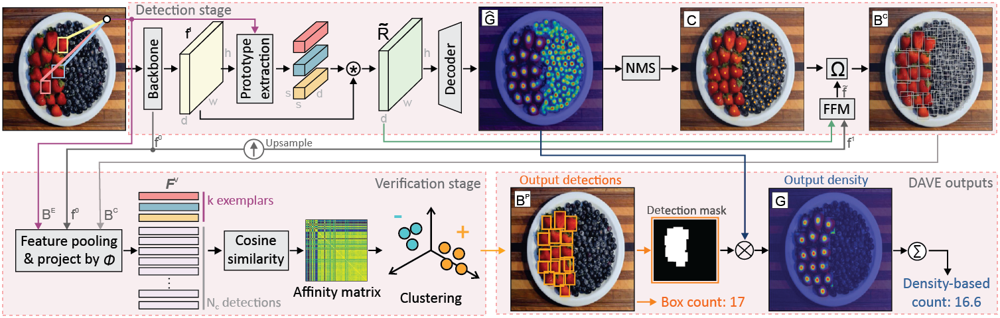

# DAVE – A Detect-and-Verify Paradigm for Low-Shot Counting
[](https://paperswithcode.com/sota/object-counting-on-fsc147?p=dave-a-detect-and-verify-paradigm-for-low)
[](https://paperswithcode.com/sota/few-shot-object-counting-and-detection-on?p=dave-a-detect-and-verify-paradigm-for-low)

This repository holds the official Pytorch implementation for the paper [DAVE – A Detect-and-Verify Paradigm for Low-Shot Counting](https://arxiv.org/pdf/2404.16622) accepted at CVPR 2024.




## Abstract
Low-shot counters estimate the number of objects corresponding to a selected category, based on only few or no exemplars annotated in the image. The current state-of-the-art estimates the total counts as the sum over the object location density map, but does not provide individual object locations and sizes, which are crucial for many applications. This is addressed by detection-based counters, which, however fall behind in the total count accuracy. Furthermore, both approaches tend to overestimate the counts in the presence of other object classes due to many false positives. We propose DAVE, a low-shot counter based on a detect-and-verify paradigm, that avoids the aforementioned issues by first generating a high-recall detection set and then verifying the detections to identify and remove the outliers. This jointly increases the recall and precision, leading to accurate counts. DAVE outperforms the top density-based counters by  20% in the total count MAE, it outperforms the most recent detection-based counter by 20% in detection quality and sets a new state-of-the-art in zero-shot as well as text-prompt-based counting.


# DAVE Installation Guide

To install and set up the DAVE environment, follow these steps:

1. **Create a Conda environment and install dependencies:**

    ```bash
    conda create -n dave python==3.8
    conda activate dave
    conda install pytorch==2.1.2 torchvision==0.16.2 torchaudio==2.1.2 pytorch-cuda=11.8 -c pytorch -c nvidia
    conda install numpy
    conda install scikit-image
    conda install scikit-learn
    conda install tqdm
    conda install pycocotools
    ```
   Additionally, if you will run text-prompt-based counting install also:
   ```bash
   conda install transformers
   ```

2. **Download the models:**

    Download the pre-trained models from [here](https://drive.google.com/drive/folders/10O4SB3Y380hcKPIK8Dt8biniVbdQ4dH4?usp=sharing) and configure dataset and model path in the `utils/argparser.py`.

3. **Run the scripts:**

   You can run the provided scripts for zero-, one-, few-shot counting or text prompt based counting. Additionally, you can use the `demo.py` file to run the model on custom images.

4. **Evaluation**
   To evaluate the results install `detectron2`, and run the script `/utils/eval.py`

## Demo
   After succesfully completing step 1 and 2 of the installation, you can run `demo.py` on your images or provided examples:

   ```bash
   python demo.py --skip_train --model_name DAVE_3_shot --model_path material --backbone resnet50 --swav_backbone --reduction 8 --num_enc_layers 3 --num_dec_layers 3 --kernel_dim 3 --emb_dim 256 --num_objects 3 --num_workers 8 --use_query_pos_emb --use_objectness --use_appearance --batch_size 1 --pre_norm
   ```
#### Zero Shot Demo
    ```
    python demo_zero.py --img_path <input-file> --show --zero_shot --two_passes --skip_train --model_name DAVE_0_shot --model_path material --backbone resnet50 --swav_backbone --reduction 8 --num_enc_layers 3 --num_dec_layers 3 --kernel_dim 3 --emb_dim 256 --num_objects 3 --num_workers 8 --use_objectness --use_appearance --batch_size 1 --pre_norm
    ```

## Citation

If you use DAVE in your research, please cite the following paper:

```bibtex
@InProceedings{Pelhan_2024_CVPR,
author = {Jer Pelhan and Alan Lukežič and Vitjan Zavrtanik and Matej Kristan},
title = {DAVE – A Detect-and-Verify Paradigm for Low-Shot Counting},
booktitle = {Proceedings of the IEEE/CVF Conference on Computer Vision and Pattern Recognition (CVPR)},
month = {June},
year = {2024}
}
```
